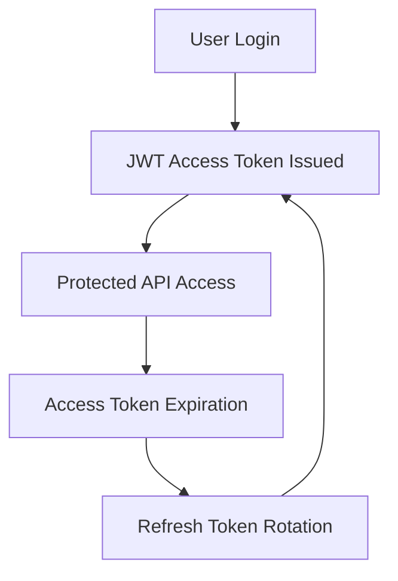
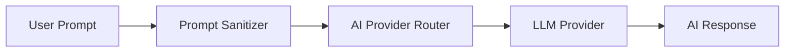

# MediTrack Backend

MediTrack is an AI-assisted biomedical equipment management backend built with Spring Boot.
The system combines secure enterprise backend architecture, predictive maintenance AI models, real-time alerts, and AI-powered medical reporting to help hospitals and biomedical departments monitor and manage medical equipment efficiently.

---

# 🚀 Project Overview

MediTrack provides a scalable backend platform for:

* Medical device lifecycle management
* Predictive maintenance using AI models
* AI-powered medical reporting & chatbot assistance
* Real-time alerting and monitoring
* Secure authentication & authorization
* Audit logging and security tracking
* Biomedical maintenance workflow management

The backend follows a modular architecture with production-oriented security hardening and AI safety protections.

---

# 🧠 Key Features

## 🔐 Enterprise Security Architecture

### Authentication & Authorization

* JWT authentication with Access + Refresh Tokens
* Refresh token rotation & revocation
* Stateless Spring Security architecture
* Role-based access control (RBAC)

### Security Hardening

* Brute force protection
* Per-IP rate limiting using Bucket4j
* Secure HTTP headers (HSTS, CSP, XSS protection)
* Hardened CORS configuration
* BCrypt password hashing (strength 12)
* Generic authentication error handling
* Production-safe exception responses

### Audit & Monitoring

* Async audit logging
* Login/logout tracking
* Security event monitoring
* Client IP extraction behind proxies

### AI Security Layer

* Prompt injection protection
* Jailbreak detection
* Oversized prompt guards
* Stored prompt sanitization

---

# 🤖 AI Module

## AI Chatbot

Interactive AI-powered medical assistant supporting:

* Medical equipment discussions
* Maintenance guidance
* Biomedical support workflows

### AI Providers

* Groq (Primary)
* OpenRouter (Fallback)

---

## AI Report Generator

Generates structured AI-powered reports using:

* Chat history
* Device telemetry
* Reported events
* Additional contextual data

---

## Predictive Maintenance AI

### Integrated Models

* Random Forest Risk Classifier
* LSTM-based predictive analysis

### Prediction Features

* Failure risk prediction
* Confidence scoring
* Recommended maintenance actions
* Telemetry analysis:

  * Temperature variance
  * Voltage drops
  * Motor vibration

---

# 🚨 Alert & Notification System

Comprehensive real-time alerting architecture.

## Supported Alert Types

* System alerts
* Security alerts
* Device alerts
* AI alerts
* User activity alerts

## Features

* AI-generated alert explanations
* Alert severity classification
* Alert deduplication
* Real-time Server-Sent Events (SSE)
* Scheduled compliance checks

---

# 🏥 Medical Device Management

## Device Lifecycle Management

* Device inventory tracking
* Department assignment
* Usage monitoring
* Sterilization tracking
* Cleaning compliance
* Maintenance scheduling

## Maintenance Operations

* Maintenance logs
* Repair tracking
* Cost tracking
* Technician assignment
* Maintenance priority management

---

# 🧱 Architecture

The project follows a modular backend architecture:

```text
Auth_Module
Ai_Module
Alerts_Module
Asset_Management_Module
Security
Infrastructure
```

This improves:

* Scalability
* Maintainability
* Separation of concerns
* Team collaboration

---

# 🗄 Database Architecture

The database is designed using normalized relational architecture with:

* Modular table separation
* AI interaction tracking
* Audit logging
* JWT refresh token storage
* Predictive maintenance data storage

Core entities include:

* users
* roles
* refresh_tokens
* chat_messages
* ai_reports
* ai_predictions
* medical_devices
* maintenance_logs
* alerts
* audit_logs

## EER Diagram

  


---

# ⚙️ Tech Stack

## Backend

* Java 21
* Spring Boot 3
* Spring Security
* Spring Data JPA
* Hibernate

## Database

* MySQL
* Flyway Migrations

## AI & ML

* Groq API
* OpenRouter API
* Random Forest
* LSTM

## Infrastructure

* Docker
* Maven

---

# 🔄 Authentication Flow

```text
User Login
    ↓
JWT Access Token Issued
    ↓
Protected API Access
    ↓
Access Token Expiration
    ↓
Refresh Token Rotation
    ↓
New Access Token Generated
```

---

# 🛡 AI Security Pipeline

```text
User Prompt
    ↓
Prompt Sanitizer
    ↓
AI Provider Router
    ↓
LLM Provider
    ↓
AI Response
```


Unsafe prompts are blocked before reaching the LLM providers.


---

# 📦 Environment Variables

The application uses environment-based configuration for sensitive values.

## Examples

* Database credentials
* JWT secrets
* AI provider API keys
* Admin bootstrap credentials
* Allowed frontend origins

A `.env.example` template is included for setup guidance.

---

# 🧪 Running the Project

## Clone Repository

```bash
git clone https://github.com/kariMMeshal/meditrack-backend.git
```

---

## Configure Environment Variables

Create:

```text
.env
```

using:

```text
.env.example
```

---

## Run with Maven

```bash
mvn spring-boot:run
```

---

## Run with Docker

```bash
docker-compose up --build
```

---

# 📌 API Documentation

Detailed API documentation is available here:

https://www.notion.so/MediTrack-Backend-API-Docs-4dd1978d13d2439e873849b50810514f

---

# 📈 Production-Oriented Features

* Modular architecture
* Async processing
* Secure deployment profiles
* AI provider failover routing
* Database migrations using Flyway
* Auditability & traceability
* Scalable backend design

---

# 🔮 Future Improvements

* Redis-backed distributed rate limiting
* WebSocket notifications
* Kubernetes deployment
* AI anomaly detection expansion
* Device telemetry streaming
* Observability dashboards
* Metrics & monitoring integration

---

# 👨‍💻 Developer

Developed by Kareem Hamdy Meshal as an AI-assisted biomedical equipment management graduation project focused on secure backend architecture, predictive maintenance, and AI-powered healthcare workflows.
